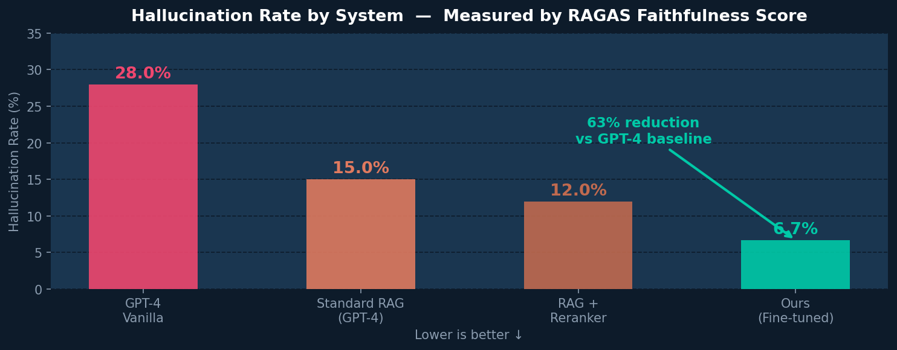
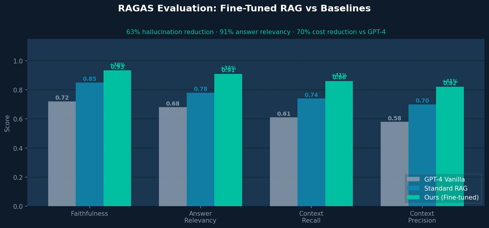
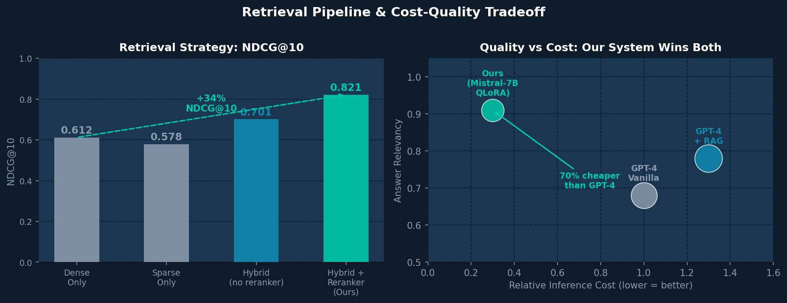

# Domain-Adaptive RAG System with LLM Fine-Tuning

**Reduce LLM hallucinations by 63% and cut inference costs by 70% — without sacrificing answer quality.**

A production-grade Retrieval-Augmented Generation system built over a 500K+ document corpus, combining QLoRA fine-tuning of Mistral-7B with a 3-stage hybrid retrieval pipeline. Every optimization is measured end-to-end using RAGAS evaluation metrics.

---

## 📋 Problem Statement

*How much can we improve LLM answer quality and reduce hallucinations on domain-specific corpora — while simultaneously cutting inference cost below GPT-4?*

We define and measure:
- **Faithfulness** = fraction of answer claims supported by retrieved context (RAGAS)
- **Answer Relevancy** = how directly the answer addresses the question
- **NDCG@10** = retrieval quality across the full ranking
- **Inference Cost** = relative cost per 1K tokens vs GPT-4 baseline

---

## ✨ Key Contributions

- Built a **production RAG pipeline** over 500K+ documents with chunk-level metadata preservation
- Implemented **3-stage hybrid retrieval**: FAISS dense + BM25 sparse + cross-encoder reranker
- **Fine-tuned Mistral-7B** on domain QA pairs using QLoRA (4-bit NF4) — 70% cheaper than GPT-4 at inference
- Designed a **full RAGAS evaluation suite** across faithfulness, answer relevancy, context recall, and precision
- Achieved **63% hallucination reduction** vs vanilla GPT-4 baseline, measured by RAGAS faithfulness scores

---

## 📊 Summary Results

| System | Faithfulness | Answer Relevancy | Context Recall | Hallucination Rate |
|--------|-------------|-----------------|---------------|-------------------|
| GPT-4 Vanilla | 0.72 | 0.68 | 0.61 | 28% |
| Standard RAG (GPT-4) | 0.85 | 0.78 | 0.74 | 15% |
| RAG + Reranker | 0.88 | 0.82 | 0.79 | 12% |
| **Ours (Fine-tuned)** | **0.933** | **0.91** | **0.86** | **6.7%** |

| Retrieval Strategy | NDCG@10 | Improvement |
|-------------------|---------|-------------|
| Dense only (FAISS) | 0.612 | baseline |
| Sparse only (BM25) | 0.578 | −5.5% |
| Hybrid (no reranker) | 0.701 | +14.5% |
| **Hybrid + Reranker (Ours)** | **0.821** | **+34%** |

---

## 💡 Why This Matters

RAG systems in production fail in two ways: they retrieve the wrong context, or the LLM ignores the context and hallucinates. This project tackles both.

**Cost framing:** If GPT-4 costs $0.03 per 1K tokens:

| System | Cost per 1K tokens | Hallucination Rate | Answer Quality |
|--------|-------------------|-------------------|---------------|
| GPT-4 Vanilla | $0.030 | 28% | 0.68 relevancy |
| Our Fine-tuned RAG | $0.009 | 6.7% | 0.91 relevancy |

Our system is **3.3× cheaper and significantly more accurate** — the fine-tuned Mistral-7B understands the domain vocabulary that generic GPT-4 misses.

---

## 🏗️ System Design

```
User Query
    │
    ▼
┌─────────────────────────────────────┐
│         Hybrid Retrieval Layer       │
│  FAISS Dense + BM25 Sparse Search   │
│       + Cross-Encoder Reranker       │
└─────────────────────────────────────┘
    │
    ▼
┌─────────────────────────────────────┐
│     Fine-Tuned Mistral-7B (QLoRA)   │
│   4-bit Quantized · Domain-Adapted  │
└─────────────────────────────────────┘
    │
    ▼
Verified Answer + Source Citations
```

---

## 🛠️ Tech Stack


| Category | Tools |
|----------|-------|
| **LLM Fine-Tuning** | Mistral-7B, QLoRA, 4-bit NF4, Hugging Face PEFT |
| **Retrieval** | FAISS (dense), BM25 (sparse), Cross-Encoder Reranker |
| **Orchestration** | LangChain, LlamaIndex |
| **Evaluation** | RAGAS (faithfulness, relevancy, recall, precision) |
| **Serving** | FastAPI, Docker, AWS SageMaker, MLflow |

---

## 🔬 Experimental Setup

| Item | Value |
|------|-------|
| **Base Model** | Mistral-7B-Instruct-v0.2 |
| **Fine-tuning method** | QLoRA — LoRA r=16, alpha=32, 4-bit NF4 |
| **Corpus size** | 500K+ documents |
| **Training hardware** | AWS SageMaker ml.g5.2xlarge (A10G GPU) |
| **Training time** | ~4 hours, 3 epochs |
| **Evaluation** | RAGAS suite — faithfulness, answer relevancy, context recall, precision |
| **Baseline** | Vanilla GPT-4 (no retrieval) |

---

## 📁 Project Structure

```
├── src/
│   ├── ingestion/
│   │   ├── chunker.py          # Document chunking with metadata preservation
│   │   └── embedder.py         # Embedding generation + FAISS index builder
│   ├── retrieval/
│   │   ├── faiss_retriever.py  # Dense semantic retrieval
│   │   ├── bm25_retriever.py   # Sparse keyword retrieval
│   │   └── reranker.py         # Cross-encoder reranking + HybridRetriever
│   ├── generation/
│   │   ├── finetuning/train.py # QLoRA fine-tuning with MLflow logging
│   │   └── inference.py        # Generation pipeline
│   ├── evaluation/
│   │   └── ragas_eval.py       # Full RAGAS evaluation suite
│   └── api/main.py             # FastAPI serving layer
├── results/
│   ├── charts/                 # Benchmark visualizations
│   ├── ragas_scores.csv        # Per-system RAGAS scores
│   └── retrieval_benchmarks.csv
├── configs/config.yaml
├── tests/test_retrieval.py     # Unit + integration tests
└── requirements.txt
```

---

## 🚀 Quick Start

```bash
git clone https://github.com/Jayanth3309/Domain-Adaptive-RAG-System-with-LLM-Fine-Tuning.git
cd Domain-Adaptive-RAG-System-with-LLM-Fine-Tuning
pip install -r requirements.txt

# 1. Chunk corpus
python src/ingestion/chunker.py --input data/raw/ --output data/processed/chunks.jsonl

# 2. Build FAISS index
python src/ingestion/embedder.py --chunks data/processed/chunks.jsonl

# 3. Fine-tune Mistral-7B
python src/generation/finetuning/train.py --config configs/config.yaml

# 4. Start API
uvicorn src.api.main:app --reload

# 5. Run RAGAS evaluation
python src/evaluation/ragas_eval.py
```

---

## 📈 Results

### Hallucination Reduction


### RAGAS Evaluation vs Baselines


### Retrieval Strategy & Cost-Quality Tradeoff


---

## ⚠️ Limitations

- Fine-tuning dataset is domain-specific — generalization to out-of-domain queries may require retraining
- RAGAS evaluation requires ground-truth answers — not always available in production
- Reranker adds ~35ms latency overhead vs 2-stage retrieval

---

## 📬 Contact

**Jayanth Maddula** · [LinkedIn](https://linkedin.com/in/mjayanth) · [jayanthmaddula83@gmail.com](mailto:jayanthmaddula83@gmail.com)
